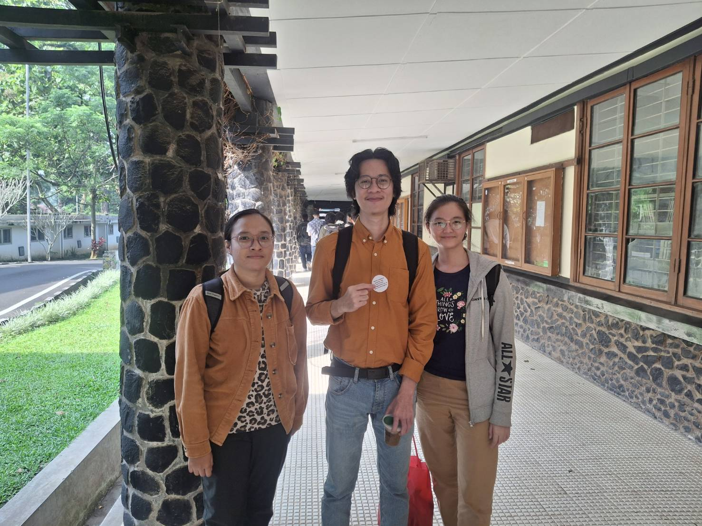

# Tugas Besar 3 IF2211 Strategi Algoritma
## Pemanfaatan Pattern Matching untuk Membangun Sistem ATS (Applicant Tracking System) Berbasis CV Digital

 
### stimaaa
| Nama | NIM |
|------|-----|
| Clarissa Nethania Tambunan | 13523016 |
| Shannon Aurellius Anastasya Lie | 13523019 |
| Andrew Isra Saputra DB | 13523110 |

## Deskripsi Singkat
<p align="justify">
Aplikasi ini adalah Sistem Pelacakan Pelamar (ATS) berbasis CV digital yang dikembangkan menggunakan Python. Fokus utamanya adalah membantu perusahaan menyaring kandidat secara efisien dengan mengekstraksi dan mencocokkan informasi dari CV digital (PDF). Sistem ini memanfaatkan algoritma Pattern Matching seperti Knuth-Morris-Pratt (KMP), Boyer-Moore (BM), dan Aho-Corasick untuk pencarian kata kunci cepat (exact match), serta Levenshtein Distance untuk pencarian yang lebih fleksibel (fuzzy match) guna menangani kesalahan ketik. Seluruh data kandidat, termasuk detail profil dan lokasi CV, disimpan dalam basis data MySQL. Aplikasi ini juga memiliki antarmuka pengguna intuitif untuk HR atau perekrut, yang memungkinkan mereka mencari, melihat ringkasan, dan mengakses CV asli kandidat dengan mudah.
</p>

## Algoritma
Aplikasi ini mengimplementasikan beberapa algoritma canggih untuk pencocokan pola teks, memastikan pencarian yang cepat dan efisien dalam dokumen CV. <br>
1. **Algoritma Knuth-Morris-Pratt (KMP)**  
   Algoritma KMP adalah metode pencarian string yang efisien yang menghindari pemeriksaan ulang karakter yang sudah dibandingkan sebelumnya. KMP menggunakan fungsi awalan (prefix function) untuk "melompati" bagian teks yang tidak mungkin cocok, sehingga mempercepat proses pencarian pola dalam teks yang panjang. Ini sangat efektif ketika pola yang dicari sering muncul atau memiliki struktur berulang.
2. **Algoritma Boyer Moore (BM)**  
   Algoritma Boyer-Moore dikenal sebagai salah satu algoritma pencarian string tercepat untuk kasus rata-rata. BM memulai pencocokan dari akhir pola (pattern) dan bergerak mundur. Jika ada ketidakcocokan, BM menggunakan dua heuristik - aturan karakter buruk (bad character rule) dan aturan sufiks baik (good suffix rule) - untuk melompati sebagian besar teks yang tidak relevan. Ini membuatnya sangat cepat, terutama untuk pola yang panjang dalam teks besar.
3. **Algoritma Aho-Corasick (Bonus)**
   Algoritma Aho-Corasick adalah ekstensi dari algoritma KMP, yang dirancang untuk mencari banyak pola secara bersamaan dalam sebuah teks. Alih-alih mencari satu pola, Aho-Corasick membangun otomata hingga terbatas (finite automaton) dari semua pola yang akan dicari. Ini memungkinkan sistem untuk menemukan semua kemunculan dari setiap pola dalam satu kali lintasan pada teks, menjadikannya sangat efisien untuk kasus di mana Anda perlu mencari banyak kata kunci sekaligus, seperti dalam analisis keahlian dari banyak CV.

## Dependency
Pastikan Anda memiliki Python (versi 3.8 atau yang lebih baru direkomendasikan) terinstal di sistem Anda. Anda dapat menginstal semua dependensi yang diperlukan menggunakan pip:
```
pip install pdfplumber
pip install faker
pip install sqlalchemy mysql-connector-python python-dotenv
pip install PySide6
pip install sympy
```

## How to run
Ikuti langkah-langkah di bawah ini untuk menyiapkan dan menjalankan aplikasi ATS:
1. Aplikasi ini memerlukan database MySQL. Jika Anda belum memilikinya, Anda perlu menginstalnya.
- Instalasi MySQL: Jika port default MySQL (3306) sudah digunakan oleh aplikasi lain seperti MariaDB, Anda disarankan untuk menginstal MySQL dan mengonfigurasi portnya ke 3308 (dengan X Protocol 33080). Pastikan untuk menambahkan direktori bin MySQL ke variabel lingkungan PATH Anda.
- Konfigurasi .env: Buat file .env di direktori root proyek Anda (sejajar dengan folder src) dan tambahkan detail koneksi database Anda. Pastikan untuk mengganti your_password dengan password MySQL Anda.
```
DB_USER=root #biasanya (sesuaikan dengan user database Anda)
DB_PASSWORD=your_password #ganti dengan password database Anda
DB_HOST=localhost #biasanya (sesuaikan dengan host database Anda) 
DB_PORT=3306 #default (sesuaikan dengan port database Anda)
DB_NAME=ats_db #jangan diubah, ini adalah nama database yang akan digunakan oleh aplikasi
```
- Ekstensi VS Code (Opsional): Untuk pengelolaan database yang lebih mudah, Anda dapat menginstal ekstensi VS Code berikut: <br>
a. SQL Tools oleh Matheus Teixeira <br>
b. SQLTools MySQL/MariaDB/TiDB Driver oleh Matheus Teixeira Konfigurasikan koneksi di SQL Tools dengan port yang Anda gunakan (misal: 3308).
2. Isi Data (Seeding)
Setelah database terkonfigurasi, jalankan skrip seeder untuk mengisi data awal ke database Anda. Anda tidak perlu membuat database ats_db secara manual jika skrip seeder akan melakukannya (meskipun langkah membuat database secara manual di atas tetap disarankan untuk memastikan hak akses).
```
python -m src.db.seeder
python -m src.db.encryption
```
3. Jalankan Aplikasi
Setelah database terisi, Anda dapat menjalankan aplikasi utama:
```
python -m src.main
```
Aplikasi ATS akan terbuka dengan antarmuka grafisnya.

## Fitur Utama

1. **Ekstraksi Teks CV Otomatis**  
   Pengguna dapat mencari pelamar menggunakan kata kunci (misalnya, skill atau pengalaman kerja). Pencarian utama dilakukan secara exact matching menggunakan algoritma Knuth-Morris-Pratt (KMP), Boyer-Moore (BM), atau Aho-Corasick untuk hasil yang cepat dan responsif.
2. **Pencarian Kandidat Cepat**  
   Menyediakan informasi mendalam mengenai status pengiriman saat ini dan log perubahan status secara kronologis, memungkinkan pengguna untuk melacak perjalanan barang secara real-time.
3. **Fuzzy Matching dengan Levenshtein Distance**  
   Jika tidak ada kecocokan persis ditemukan, sistem akan melakukan fuzzy matching menggunakan algoritma Levenshtein Distance untuk menemukan CV yang paling mirip, bahkan jika ada sedikit perbedaan atau kesalahan ketik pada kata kunci.
4. **Ringkasan & Detail CV**  
   Pengguna dapat melihat ringkasan informasi penting pelamar (identitas, keahlian, pengalaman, pendidikan) yang diekstrak menggunakan Regular Expression (Regex). Tersedia juga opsi untuk melihat langsung file CV asli dalam format PDF.
5. **Pilihan Algoritma & Urutan Hasil**  
   Pengguna dapat memilih algoritma pencarian yang ingin digunakan. Hasil pencarian akan ditampilkan dengan CV yang paling relevan di urutan teratas, diurutkan berdasarkan jumlah kecocokan kata kunci.
6. **Tampilan Waktu Eksekusi**  
   Sistem menampilkan waktu yang dibutuhkan untuk pencarian exact match dan fuzzy match (Levenshtein Distance), memberikan informasi performa kepada pengguna.
   
## Fitur Bonus
1. **Enkripsi Data Profil Applicant**  
    [OTWWW ......................

2. **Implementasi Algoritma Aho-Corasick**  
3. **Pembuatan Video Aplikasi**  
   
## Tampilan Aplikasi
| Halaman | Screenshot |
|---|---|
| Search |  |
| Summary |  |

## Struktur Program
```

tolong rapikan tree berikut

.

├── MySQLCV.session.sql  # Skrip sesi database MySQL

├── README.md            # Dokumentasi utama proyek

├── data/                # Berisi kumpulan data CV (berkas PDF) yang dikategorikan berdasarkan profesi

│   ├── ACCOUNTANT/

│   ├── ADVOCATE/

│   ├── AGRICULTURE/

│   ├── ... (dan kategori profesi lainnya)

├── doc/                 # Dokumentasi tambahan atau aset proyek

│   └── creators.jpg

└── src/                 # Kode sumber aplikasi utama

    ├── core/            # Implementasi inti algoritma pencarian dan pemrosesan teks

    │   ├── aho_corasick.py   # Algoritma Aho-Corasick untuk pencarian string

    │   ├── boyer_moore.py    # Algoritma Boyer-Moore untuk pencarian string

    │   ├── encryption.py     # Logika enkripsi (mungkin untuk data atau kredensial)

    │   ├── kmp.py            # Algoritma Knuth-Morris-Pratt (KMP) untuk pencarian string

    │   ├── levenshtein.py    # Algoritma Levenshtein untuk perhitungan jarak edit (kesamaan string)

    │   ├── pdf_parser.py     # Modul untuk mengekstrak teks dari berkas PDF

    │   ├── search.py         # Logika utama untuk melakukan pencarian CV

    │   └── summary.py        # Logika untuk membuat ringkasan CV

    ├── db/              # Modul untuk interaksi dengan database

    │   ├── ats.sql           # Skema database untuk Applicant Tracking System

    │   ├── database.py       # Koneksi dan operasi database

    │   ├── encryption.py     # (Kemungkinan) Enkripsi terkait database

    │   ├── models.py         # Definisi model data untuk ORM/mapping database

    │   └── tubes3_seeding.sql# Skrip untuk mengisi database dengan data awal (seeding)

    ├── main.py          # Titik masuk utama aplikasi (main entry point)

    ├── ui/              # Antarmuka Pengguna (User Interface) aplikasi

    │   ├── components/       # Komponen UI yang dapat digunakan kembali

    │   │   ├── keyword_input.py # Komponen input kata kunci

    │   │   └── result_card.py   # Komponen untuk menampilkan hasil pencarian

    │   ├── main_window.py    # Jendela utama aplikasi

    │   ├── search_page.py    # Halaman/view untuk fungsi pencarian CV

    │   └── summary_page.py   # Halaman/view untuk menampilkan ringkasan CV

    └── utils/           # Utility functions (fungsi pembantu umum)

        ├── file_utils.py     # Utilitas terkait operasi berkas

        ├── keyword_utils.py  # Utilitas terkait pemrosesan kata kunci

        └── timer.py          # Utilitas untuk pengukuran waktu (mis. kinerja pencarian)
```
